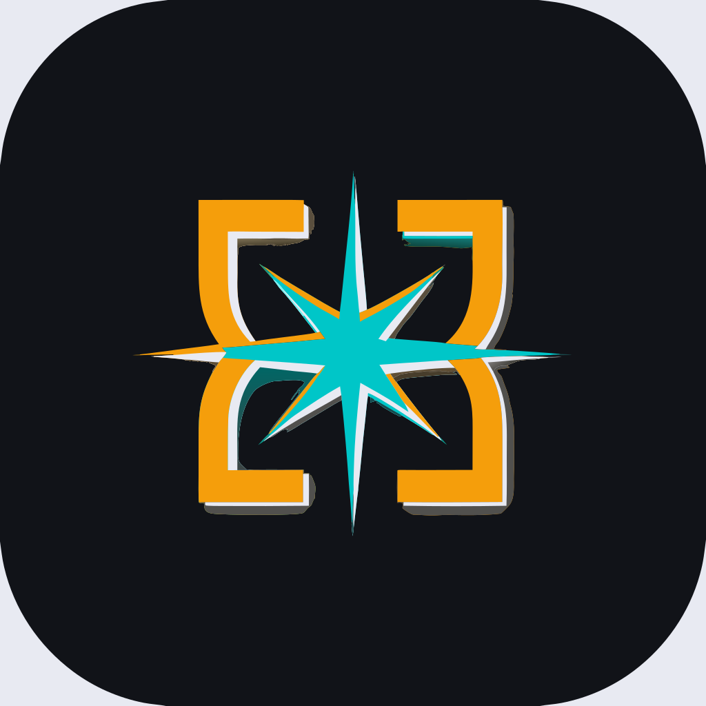
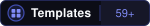
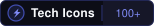
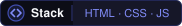

<div align="center">



# README Studio

### Visual block editor for GitHub profile READMEs

Pick a template, drag blocks, tweak every property — export clean, ready-to-paste markdown.<br/>
No login. No build step. Runs in the browser.

<p>
  
  
  
  
  
</p>


<p><a href="https://takemygunq.github.io/readme-studio/">Open README Studio →</a></p>

</div>

<!-- ───────────────────────────────────────────── -->
<div align="center">
<svg width="100%" height="40" viewBox="0 0 1200 40" preserveAspectRatio="none" xmlns="http://www.w3.org/2000/svg">
  <path d="M0,20 Q150,0 300,20 Q450,40 600,20 Q750,0 900,20 Q1050,40 1200,20 L1200,40 L0,40 Z" fill="#ECEEFF" opacity="0.5"/>
</svg>
</div>

---

## How it works

### 1. Start from a template or build from scratch

Open the **Template Gallery** (59 templates across 6 categories) or drag blocks from the left panel onto the canvas. Every block is pre-configured — just add your username and the stats cards fill themselves.

<table>
  <tr>
    <td width="50%">
      <br/>
      <br/>
      <br/>
      <br/>
      <br/>
      
    </td>
    <td width="50%">
      Search by keyword, filter by category, click to load. The canvas is replaced immediately — no confirmation, no friction.
    </td>
  </tr>
</table>

### 2. Click any block to edit its properties

Select a block on the canvas — the right panel shows all its controls: text fields, sliders, dropdowns, color pickers, icon selectors. Every change reflects on the canvas instantly.

**Block types available:**

| Category | Blocks |
|---|---|
| Header | Wave Banner (Capsule Render), Typing Animation |
| Text | Heading, Paragraph |
| Content | Tech Stack (100+ icons), Custom Markdown, SVG Icon |
| Stats | GitHub Stats, Streak Stats, Top Languages, Trophy Cabinet |
| Social | Social Links, View Counter |
| Layout | Divider |

### 3. Drag to reorder

Every block has a drag handle. Grab and drop to reorder the canvas — the markdown output updates immediately.

### 4. Export

Switch to **Markdown** to see the raw output, or click **Copy Markdown** / **.md** to export. Paste into `<your-username>/<your-username>/README.md` on GitHub.

---

<!-- ───────────────────────────────────────────── -->
<div align="center">
<svg width="100%" height="1" viewBox="0 0 1200 1" xmlns="http://www.w3.org/2000/svg">
  <line x1="0" y1="0" x2="1200" y2="0" stroke="#5B6CF9" stroke-width="2" stroke-dasharray="4 6" opacity="0.4"/>
</svg>
</div>

## Features

- **Visual block editor** — click to select, right panel to configure, drag to reorder
- **59 ready-made templates** — roles (Full Stack, ML Engineer, DevOps…), languages (Rust, Go, Python…), themes (Neon, Ocean, Deep Space…), quick-starts
- **Template gallery** — search by keyword, filter by category, instant preview via color gradient cards
- **100+ tech icons** — languages, frameworks, databases, cloud, DevOps, AI/ML; searchable by name, filterable by category
- **Live markdown output** — switches between canvas and markdown with no re-generation delay
- **GitHub Stats integration** — `github-readme-stats`, `streak-stats.demolab.com`, top languages, trophy cabinet; pick a color theme once and all cards match
- **Animated headers** — wave, shark, rect, venom banners from Capsule Render; typing animation from `readme-typing-svg`
- **Zero dependencies** — pure HTML, CSS and vanilla JS; no `node_modules`, no build tool, no server

---

## Quick start

No installation. Clone and open:

```bash
git clone https://github.com/takemygunq/readme-studio
cd readme-studio
python3 -m http.server 8080
# open http://localhost:8080
```

Or just open `index.html` directly in the browser (some external badge images won't load without a server due to CORS).

## Deploy your own copy

Fork → **Settings → Pages → Source: main / (root)** → your copy is live at `https://<username>.github.io/readme-studio/` in under a minute.

Works on Netlify Drop, Vercel, Cloudflare Pages, or any CDN — drag the folder and you're done.

---

<!-- ───────────────────────────────────────────── -->
<div align="center">
<svg width="200" height="24" viewBox="0 0 200 24" xmlns="http://www.w3.org/2000/svg">
  <rect x="0" y="10" width="80" height="2" rx="1" fill="#5B6CF9" opacity="0.3"/>
  <circle cx="100" cy="12" r="4" fill="#5B6CF9" opacity="0.6"/>
  <rect x="120" y="10" width="80" height="2" rx="1" fill="#5B6CF9" opacity="0.3"/>
</svg>
</div>

## Tech

```
index.html          app shell: toolbar, 3-panel grid, gallery modal
css/style.css       design system: tokens, layout, components
js/icons-data.js    icon registry (100+ entries with shields.io params)
js/app.js           block registry, state, canvas render, gallery, markdown export
docs/media/         demo GIF and screenshots
public/brand/       logo, mark, icon SVGs
```

**External services used in generated README output** (no API keys, no accounts):

| Service | Used for |
|---|---|
| `capsule-render.vercel.app` | Animated wave / shark banners |
| `readme-typing-svg.demolab.com` | Typing animation |
| `shields.io` | Tech stack badges |
| `github-readme-stats.vercel.app` | GitHub stats card |
| `streak-stats.demolab.com` | Streak card |
| `github-profile-trophy` | Trophy cabinet |
| `komarev.com` | Profile view counter |

---

## License

MIT
